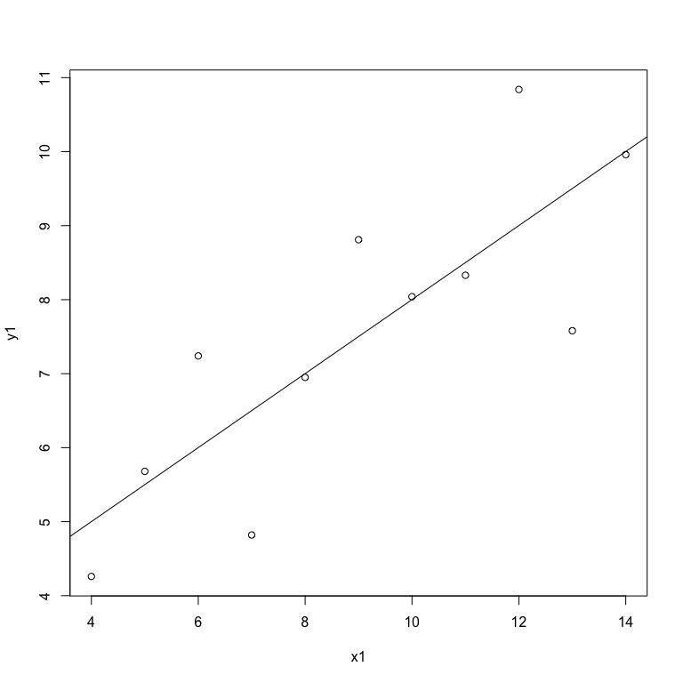
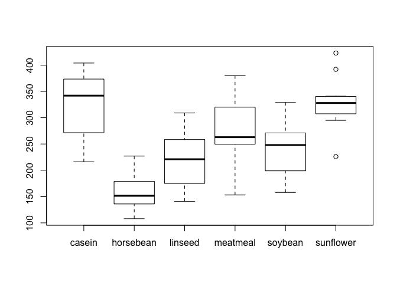
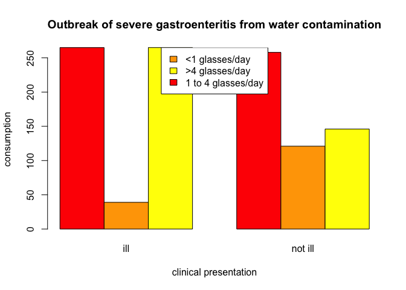
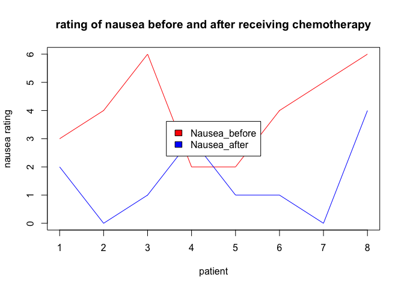
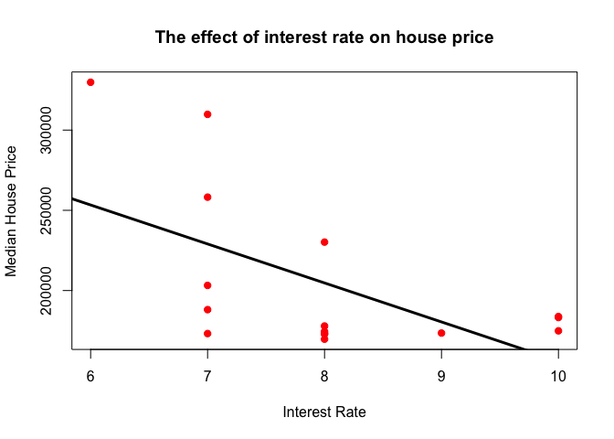
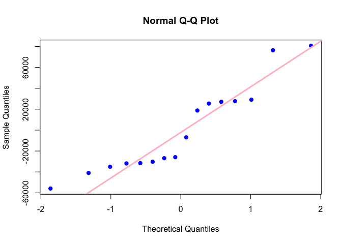
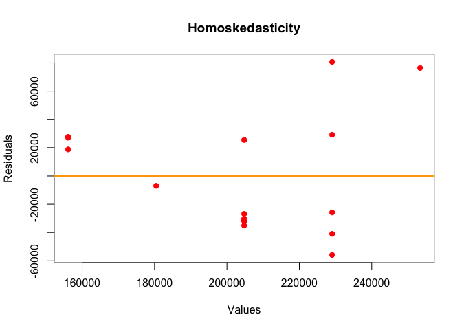

Assignment 6
================
Jacintha Johnson
07/02/2017

Hello Octocat
-------------

I love Octocat. She's the coolest cat in town.


``` r
data("anscombe")
dim.data.frame(anscombe)
```

    ## [1] 11  8

``` r
colnames(anscombe)
```

    ## [1] "x1" "x2" "x3" "x4" "y1" "y2" "y3" "y4"

``` r
head(anscombe)
```

    ##   x1 x2 x3 x4   y1   y2    y3   y4
    ## 1 10 10 10  8 8.04 9.14  7.46 6.58
    ## 2  8  8  8  8 6.95 8.14  6.77 5.76
    ## 3 13 13 13  8 7.58 8.74 12.74 7.71
    ## 4  9  9  9  8 8.81 8.77  7.11 8.84
    ## 5 11 11 11  8 8.33 9.26  7.81 8.47
    ## 6 14 14 14  8 9.96 8.10  8.84 7.04

``` r
tail(anscombe)
```

    ##    x1 x2 x3 x4    y1   y2   y3    y4
    ## 6  14 14 14  8  9.96 8.10 8.84  7.04
    ## 7   6  6  6  8  7.24 6.13 6.08  5.25
    ## 8   4  4  4 19  4.26 3.10 5.39 12.50
    ## 9  12 12 12  8 10.84 9.13 8.15  5.56
    ## 10  7  7  7  8  4.82 7.26 6.42  7.91
    ## 11  5  5  5  8  5.68 4.74 5.73  6.89

``` r
summary(anscombe)
```

    ##        x1             x2             x3             x4    
    ##  Min.   : 4.0   Min.   : 4.0   Min.   : 4.0   Min.   : 8  
    ##  1st Qu.: 6.5   1st Qu.: 6.5   1st Qu.: 6.5   1st Qu.: 8  
    ##  Median : 9.0   Median : 9.0   Median : 9.0   Median : 8  
    ##  Mean   : 9.0   Mean   : 9.0   Mean   : 9.0   Mean   : 9  
    ##  3rd Qu.:11.5   3rd Qu.:11.5   3rd Qu.:11.5   3rd Qu.: 8  
    ##  Max.   :14.0   Max.   :14.0   Max.   :14.0   Max.   :19  
    ##        y1               y2              y3              y4        
    ##  Min.   : 4.260   Min.   :3.100   Min.   : 5.39   Min.   : 5.250  
    ##  1st Qu.: 6.315   1st Qu.:6.695   1st Qu.: 6.25   1st Qu.: 6.170  
    ##  Median : 7.580   Median :8.140   Median : 7.11   Median : 7.040  
    ##  Mean   : 7.501   Mean   :7.501   Mean   : 7.50   Mean   : 7.501  
    ##  3rd Qu.: 8.570   3rd Qu.:8.950   3rd Qu.: 7.98   3rd Qu.: 8.190  
    ##  Max.   :10.840   Max.   :9.260   Max.   :12.74   Max.   :12.500



``` r
#import readr package
library(readr)

#read the csv file
analgesic <- read_csv("https://dl.dropboxusercontent.com/u/11805474/painblogr/biostats/assignments/analgesic.csv")
```

    ## Parsed with column specification:
    ## cols(
    ##   ID = col_integer(),
    ##   Group = col_character(),
    ##   Measurement_1 = col_integer(),
    ##   Measurement_2 = col_integer(),
    ##   Measurement_3 = col_integer()
    ## )

``` r
data.frame(analgesic)
```

    ##    ID     Group Measurement_1 Measurement_2 Measurement_3
    ## 1   1 Analgesic            26            26            21
    ## 2   2 Analgesic            29            26            23
    ## 3   3 Analgesic            24            28            22
    ## 4   4 Analgesic            25            22            24
    ## 5   5 Analgesic            24            28            23
    ## 6   6 Analgesic            22            23            26
    ## 7   7 Analgesic            25            25            30
    ## 8   8 Analgesic            28            21            21
    ## 9   9 Analgesic            22            26            20
    ## 10 10 Analgesic            18            25            29
    ## 11 11 Analgesic            25            29            28
    ## 12 12 Analgesic            26            25            23
    ## 13 13 Analgesic            26            25            26
    ## 14 14 Analgesic            19            30            27
    ## 15 15 Analgesic            24            20            24
    ## 16 16 Analgesic            23            24            27
    ## 17 17 Analgesic            24            32            28
    ## 18 18 Analgesic            24            17            25
    ## 19 19 Analgesic            23            25            23
    ## 20 20 Analgesic            30            18            25
    ## 21 21   Placebo            19            12            18
    ## 22 22   Placebo            10            16            18
    ## 23 23   Placebo            12            11            20
    ## 24 24   Placebo            17            17            18
    ## 25 25   Placebo            18            18            20
    ## 26 26   Placebo            12            16            16
    ## 27 27   Placebo            14            17            17
    ## 28 28   Placebo            20            19            18
    ## 29 29   Placebo            16            19            15
    ## 30 30   Placebo            17            15            13
    ## 31 31   Placebo            18            21            14
    ## 32 32   Placebo            20            13            16
    ## 33 33   Placebo            12             8            21
    ## 34 34   Placebo            20            17            16
    ## 35 35   Placebo            17            21            15
    ## 36 36   Placebo            19            17            15
    ## 37 37   Placebo            14            19            13
    ## 38 38   Placebo            17            19            13
    ## 39 39   Placebo            11            20            18
    ## 40 40   Placebo            15            18            12

``` r
#saving the data from analgecis to df
df <- data.frame(analgesic)
print(df)
```

    ##    ID     Group Measurement_1 Measurement_2 Measurement_3
    ## 1   1 Analgesic            26            26            21
    ## 2   2 Analgesic            29            26            23
    ## 3   3 Analgesic            24            28            22
    ## 4   4 Analgesic            25            22            24
    ## 5   5 Analgesic            24            28            23
    ## 6   6 Analgesic            22            23            26
    ## 7   7 Analgesic            25            25            30
    ## 8   8 Analgesic            28            21            21
    ## 9   9 Analgesic            22            26            20
    ## 10 10 Analgesic            18            25            29
    ## 11 11 Analgesic            25            29            28
    ## 12 12 Analgesic            26            25            23
    ## 13 13 Analgesic            26            25            26
    ## 14 14 Analgesic            19            30            27
    ## 15 15 Analgesic            24            20            24
    ## 16 16 Analgesic            23            24            27
    ## 17 17 Analgesic            24            32            28
    ## 18 18 Analgesic            24            17            25
    ## 19 19 Analgesic            23            25            23
    ## 20 20 Analgesic            30            18            25
    ## 21 21   Placebo            19            12            18
    ## 22 22   Placebo            10            16            18
    ## 23 23   Placebo            12            11            20
    ## 24 24   Placebo            17            17            18
    ## 25 25   Placebo            18            18            20
    ## 26 26   Placebo            12            16            16
    ## 27 27   Placebo            14            17            17
    ## 28 28   Placebo            20            19            18
    ## 29 29   Placebo            16            19            15
    ## 30 30   Placebo            17            15            13
    ## 31 31   Placebo            18            21            14
    ## 32 32   Placebo            20            13            16
    ## 33 33   Placebo            12             8            21
    ## 34 34   Placebo            20            17            16
    ## 35 35   Placebo            17            21            15
    ## 36 36   Placebo            19            17            15
    ## 37 37   Placebo            14            19            13
    ## 38 38   Placebo            17            19            13
    ## 39 39   Placebo            11            20            18
    ## 40 40   Placebo            15            18            12

``` r
#dimensions of the data set
dim.data.frame(df)
```

    ## [1] 40  5

``` r
#summary stastistics of each column
summary(df)
```

    ##        ID           Group           Measurement_1   Measurement_2 
    ##  Min.   : 1.00   Length:40          Min.   :10.00   Min.   : 8.0  
    ##  1st Qu.:10.75   Class :character   1st Qu.:17.00   1st Qu.:17.0  
    ##  Median :20.50   Mode  :character   Median :20.00   Median :20.0  
    ##  Mean   :20.50                      Mean   :20.12   Mean   :20.7  
    ##  3rd Qu.:30.25                      3rd Qu.:24.00   3rd Qu.:25.0  
    ##  Max.   :40.00                      Max.   :30.00   Max.   :32.0  
    ##  Measurement_3  
    ##  Min.   :12.00  
    ##  1st Qu.:16.00  
    ##  Median :20.50  
    ##  Mean   :20.52  
    ##  3rd Qu.:24.25  
    ##  Max.   :30.00

``` r
#first six lines of the data set
head(df)
```

    ##   ID     Group Measurement_1 Measurement_2 Measurement_3
    ## 1  1 Analgesic            26            26            21
    ## 2  2 Analgesic            29            26            23
    ## 3  3 Analgesic            24            28            22
    ## 4  4 Analgesic            25            22            24
    ## 5  5 Analgesic            24            28            23
    ## 6  6 Analgesic            22            23            26

``` r
#last six lines of the data set
tail(df)
```

    ##    ID   Group Measurement_1 Measurement_2 Measurement_3
    ## 35 35 Placebo            17            21            15
    ## 36 36 Placebo            19            17            15
    ## 37 37 Placebo            14            19            13
    ## 38 38 Placebo            17            19            13
    ## 39 39 Placebo            11            20            18
    ## 40 40 Placebo            15            18            12

``` r
#importing packages
library(dplyr)
```

    ## 
    ## Attaching package: 'dplyr'

    ## The following objects are masked from 'package:stats':
    ## 
    ##     filter, lag

    ## The following objects are masked from 'package:base':
    ## 
    ##     intersect, setdiff, setequal, union

``` r
library(tidyr)
library(forcats)

alt_data <- df %>%
#tidy df from wide format to long format
gather(key =  Measurements,
       value = Results, 
       Measurement_1:Measurement_3) %>%
#grouping table by ID  
group_by(ID) %>%

#summmarize data according to mean across measurements of each individual
summarise(Mean = mean(Results)) %>%

#display the data
print(alt_data)
```

    ## # A tibble: 40 <U+00D7> 2
    ##       ID     Mean
    ##    <int>    <dbl>
    ## 1      1 24.33333
    ## 2      2 26.00000
    ## 3      3 24.66667
    ## 4      4 23.66667
    ## 5      5 25.00000
    ## 6      6 23.66667
    ## 7      7 26.66667
    ## 8      8 23.33333
    ## 9      9 22.66667
    ## 10    10 24.00000
    ## # ... with 30 more rows

``` r
#import packages
library(readr)
library(tidyr)
library(dplyr)
library(graphics)
library(grDevices)

#read the csv file
chicken <- read_csv("https://dl.dropboxusercontent.com/u/11805474/painblogr/biostats/assignments/chick-weights.csv?dl=1")
```

    ## Parsed with column specification:
    ## cols(
    ##   weight = col_integer(),
    ##   feed = col_character()
    ## )

``` r
chick_alt_data <- chicken %>%
  
#group the data by feed
group_by(feed) %>%
  
#summmarize data
summarise(Mean = mean(weight))

print(chick_alt_data)
```

    ## # A tibble: 6 <U+00D7> 2
    ##        feed     Mean
    ##       <chr>    <dbl>
    ## 1    casein 323.5833
    ## 2 horsebean 160.2000
    ## 3   linseed 218.7500
    ## 4  meatmeal 276.9091
    ## 5   soybean 246.4286
    ## 6 sunflower 328.9167

``` r
# One-way ANOVA
chicktest<- aov(weight ~ feed,
           data = chicken)

summary(chicktest)
```

    ##             Df Sum Sq Mean Sq F value   Pr(>F)    
    ## feed         5 231129   46226   15.37 5.94e-10 ***
    ## Residuals   65 195556    3009                     
    ## ---
    ## Signif. codes:  0 '***' 0.001 '**' 0.01 '*' 0.05 '.' 0.1 ' ' 1

``` r
#plot box plot
boxplot(weight ~ feed, data = chicken)
```



``` r
#null hypothesis: All feeds result in same growth rate
#alternative hypothesis: sunflower feed chickens had the greatest growth rate
#Test: Kruskal-Wallis test
#assumptions:errors are independent, data are unmatched, samples are drawn from populations with same shape distributions
#outcome interpretation:p is less than 0.05 therefore reject null hypothesis.
```

``` r
#import packages
library(readr)
library(tidyr)
library(dplyr)
library(graphics)
library(grDevices)

#read the csv file
hot_zone_x <- read_csv("https://dl.dropboxusercontent.com/u/11805474/painblogr/biostats/assignments/gastroenteritis.csv?dl=1")
```

    ## Parsed with column specification:
    ## cols(
    ##   Consumption = col_character(),
    ##   Outcome = col_character()
    ## )

``` r
hot_zone_y <- xtabs(~Consumption + Outcome, data = hot_zone_x)
head(hot_zone_x)
```

    ## # A tibble: 6 <U+00D7> 2
    ##       Consumption Outcome
    ##             <chr>   <chr>
    ## 1 < 1 glasses/day     ill
    ## 2 < 1 glasses/day     ill
    ## 3 < 1 glasses/day     ill
    ## 4 < 1 glasses/day     ill
    ## 5 < 1 glasses/day     ill
    ## 6 < 1 glasses/day     ill

``` r
table(hot_zone_x$Consumption, hot_zone_x$Outcome)
```

    ##                     
    ##                      ill not ill
    ##   1 to 4 glasses/day 265     258
    ##   < 1 glasses/day     39     121
    ##   > 4 glasses/day    265     146

``` r
#plot data
barplot(hot_zone_y , beside = TRUE, ylab = 'consumption', xlab= 'clinical presentation', main = 'Outbreak of severe gastroenteritis from water contamination', col= c("red", "orange", "yellow"))

legend('top', c("<1 glasses/day", ">4 glasses/day", "1 to 4 glasses/day"), fill = c("orange", "yellow", "red"))
```



``` r
#statistical test
hot_zone_z <- chisq.test(hot_zone_y, correct = TRUE)
hot_zone_z
```

    ## 
    ##  Pearson's Chi-squared test
    ## 
    ## data:  hot_zone_y
    ## X-squared = 74.925, df = 2, p-value < 2.2e-16

``` r
#null hypothesis: outbreak not caused by the contaminated drinking water
#alternative hypothesis: outbreak is caused by the contimanated drinking water
#test: chi square
#assumptions: - 3 categorical variables from the same population of data
#interpretation:p value is less than 0.05 therefore reject the null hypothesis
```

``` r
#import packages
library(readr)
library(tidyr)
library(dplyr)
library(graphics)
library(grDevices)

#read the csv file
nausea <- read_csv("https://dl.dropboxusercontent.com/u/11805474/painblogr/biostats/assignments/nausea.csv?dl=1")
```

    ## Parsed with column specification:
    ## cols(
    ##   Patient = col_integer(),
    ##   Nausea_before = col_integer(),
    ##   Nausea_after = col_integer()
    ## )

``` r
nausea[8,3]= 4
nausea
```

    ## # A tibble: 8 <U+00D7> 3
    ##   Patient Nausea_before Nausea_after
    ##     <int>         <int>        <dbl>
    ## 1       1             3            2
    ## 2       2             4            0
    ## 3       3             6            1
    ## 4       4             2            3
    ## 5       5             2            1
    ## 6       6             4            1
    ## 7       7             5            0
    ## 8       8             6            4

``` r
# plot a grah
plot(nausea$Nausea_before ~ nausea$Patient, type = "l", ylim = c(0,6), xlab = 'patient', ylab = 'nausea rating', col = 'red', main = 'rating of nausea before and after receiving chemotherapy')

lines(nausea$Nausea_after, col = 'blue')
legend("center", c("Nausea_before", "Nausea_after"), fill = c("red", "blue"))
```



``` r
#statistical test
wilcox.test(nausea$Nausea_before,nausea$Nausea_after, paired = TRUE)
```

    ## Warning in wilcox.test.default(nausea$Nausea_before, nausea$Nausea_after, :
    ## cannot compute exact p-value with ties

    ## 
    ##  Wilcoxon signed rank test with continuity correction
    ## 
    ## data:  nausea$Nausea_before and nausea$Nausea_after
    ## V = 34, p-value = 0.02897
    ## alternative hypothesis: true location shift is not equal to 0

``` r
#null hypothesis: 5HT3-receptor blocker led to nausea
#alternative hypothesis:5HT3-receptor blocker did not lead to nausea
#assumption: data is non-parametric
#outcome interpretation:p-value is less than 0.05 therefore we reject the null hgypothesis. 
```

``` r
library(ggplot2)

#null hypothesis: The housing price independnat of the interest rate
#alternative hypothesis: The housing prive is dependant on the interest rate

house_price <- read.csv("https://dl.dropboxusercontent.com/u/11805474/painblogr/biostats/assignments/housing-prices.csv?dl=1")

data(house_price)
```

    ## Warning in data(house_price): data set 'house_price' not found

``` r
print(house_price)
```

    ##    interest_rate median_house_price_USD
    ## 1             10                 183800
    ## 2             10                 183200
    ## 3             10                 174900
    ## 4              9                 173500
    ## 5              8                 172900
    ## 6              7                 173200
    ## 7              8                 173200
    ## 8              8                 169700
    ## 9              8                 174500
    ## 10             8                 177900
    ## 11             7                 188100
    ## 12             7                 203200
    ## 13             8                 230200
    ## 14             7                 258200
    ## 15             7                 309800
    ## 16             6                 329800
    ## 17            NA                     NA

``` r
# Plotting the input data
plot (house_price$interest_rate,house_price$median_house_price_USD, main = 'The effect of interest rate on house price', xlab = "Interest Rate", ylab = "Median House Price", pch = 19, col = "red", fill = c("red"))
```

    ## Warning in plot.window(...): "fill" is not a graphical parameter

    ## Warning in plot.xy(xy, type, ...): "fill" is not a graphical parameter

    ## Warning in axis(side = side, at = at, labels = labels, ...): "fill" is not
    ## a graphical parameter

    ## Warning in axis(side = side, at = at, labels = labels, ...): "fill" is not
    ## a graphical parameter

    ## Warning in box(...): "fill" is not a graphical parameter

    ## Warning in title(...): "fill" is not a graphical parameter

``` r
abline(lm(house_price$median_house_price_USD~house_price$interest_rate, data = house_price), lwd = 3, col = "black" )
```



``` r
# Calculating linear regression
ln_house <- lm(house_price$median_house_price_USD~house_price$interest_rate, data = house_price)
summary (ln_house)
```

    ## 
    ## Call:
    ## lm(formula = house_price$median_house_price_USD ~ house_price$interest_rate, 
    ##     data = house_price)
    ## 
    ## Residuals:
    ##    Min     1Q Median     3Q    Max 
    ## -55865 -31631 -16406  27212  80735 
    ## 
    ## Coefficients:
    ##                           Estimate Std. Error t value Pr(>|t|)    
    ## (Intercept)                 399229      74427   5.364 9.99e-05 ***
    ## house_price$interest_rate   -24309       9205  -2.641   0.0194 *  
    ## ---
    ## Signif. codes:  0 '***' 0.001 '**' 0.01 '*' 0.05 '.' 0.1 ' ' 1
    ## 
    ## Residual standard error: 43180 on 14 degrees of freedom
    ##   (1 observation deleted due to missingness)
    ## Multiple R-squared:  0.3325, Adjusted R-squared:  0.2848 
    ## F-statistic: 6.974 on 1 and 14 DF,  p-value: 0.01937

``` r
# Diagnostic 1: Gaussian Residual Distribution
qqnorm(ln_house$residuals, pch = 19, col = "blue")
qqline(ln_house$residuals, lwd = 3, col = "pink")
```



``` r
# Diagnostic 2: Homoskedasticity
plot(x= ln_house$fitted.values, y=ln_house$residuals, xlab = "Values", ylab = "Residuals", pch = 19, col = "red", main = "Homoskedasticity")
abline(h=0, lwd = 3, col = "orange")
```



``` r
# Plot generalized linear model
glm(house_price$median_house_price_USD~house_price$interest_rate, data = house_price)
```

    ## 
    ## Call:  glm(formula = house_price$median_house_price_USD ~ house_price$interest_rate, 
    ##     data = house_price)
    ## 
    ## Coefficients:
    ##               (Intercept)  house_price$interest_rate  
    ##                    399229                     -24309  
    ## 
    ## Degrees of Freedom: 15 Total (i.e. Null);  14 Residual
    ##   (1 observation deleted due to missingness)
    ## Null Deviance:       3.91e+10 
    ## Residual Deviance: 2.61e+10  AIC: 390.8

``` r
# interpretations: p-value < 0.05 therefore reject null hypothesis.
```
